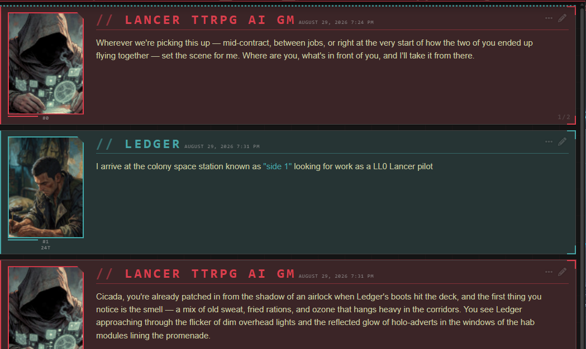

# Lancer // CompCon — SillyTavern theme

A SillyTavern UI theme built on COMP/CON's actual palette, plus a small
extension that turns the theme's options into checkboxes and sliders.



Messages are colour-coded by Lancer manufacturer — assign a faction per
character, or let the two defaults handle it.

Built alongside
[**FoundryVTT → SillyTavern NHP Uplink**](https://github.com/masterevan27/foundryvtt-to-sillytavern-nhp-uplink),
which streams live LANCER combat out of Foundry VTT into SillyTavern so a card
can run as an AI GM. Neither needs the other — this is a plain SillyTavern theme
— but the faction colouring was tuned for that kind of table. See
[Companion project](#companion-project).

## What's here

| File | Purpose |
| --- | --- |
| `lancer-compcon.css` | The theme. Source of truth — edit this, not the JSON. |
| `Lancer CompCon.json` | Generated theme preset, imported through SillyTavern. |
| `build-theme.js` | Bakes the CSS into `Lancer CompCon.json`; `--install` copies both parts into SillyTavern. |
| `manifest.json`, `index.js`, `style.css` | The "Lancer Theme Controls" UI extension. These sit at the repo root so SillyTavern's extension installer can clone this repo directly. |

## Install

Two halves: the **theme** (colours and layout) and the **extension** (the
checkboxes and sliders that drive it). The theme works on its own; the
extension does nothing without it.

### 1. Extension

In SillyTavern: **Extensions → Install extension**, and paste:

```
https://github.com/masterevan27/sillytavern-lancer-ui-theme
```

### 2. Theme

**User Settings → Themes → Import**, and pick `Lancer CompCon.json` from this
repo. Then select **Lancer CompCon** in the theme dropdown.

Reload the browser after both steps.

### Installing from a local clone

If you are editing the CSS, `--install` copies both halves straight into
SillyTavern. Point it at your user-data directory — the folder containing
`themes/` and `extensions/`, usually `<SillyTavern>/data/default-user`:

```
node build-theme.js --install --st-root="D:/SillyTavern/data/default-user"
```

`ST_ROOT` works as an environment variable instead. Without `--install` the
script only regenerates `Lancer CompCon.json` next to itself.

## Companion project

[**FoundryVTT → SillyTavern NHP Uplink**](https://github.com/masterevan27/foundryvtt-to-sillytavern-nhp-uplink)
turns a SillyTavern character card into an AI GM for a live LANCER game: a
Foundry module streams the real combat — attacks, damage, structure, statuses,
board state — into SillyTavern, the card narrates it, and its replies go back
into Foundry chat. Foundry stays the authority on mechanics; the model only
writes fiction.

Neither project requires the other. The uplink runs under any SillyTavern theme,
and this theme is just a theme without it. Together, the faction colours give you
the AI GM, your pilots and the hostiles distinguishable at a glance mid-fight —
which is what they were tuned for. Its README lists the theme as an optional
install step.

## Palette

Read verbatim off COMP/CON's `.v-theme--gms_dark` block — the app's default
dark GMS theme — not eyeballed. (Its other registered themes are `gms`,
`ipsn`, `ssc`, `ha`, `horus`, `msmc`, `galsim`, `horizon`, `hc_dark`,
`theme_lc_solarized`, plus plain `light` / `dark`.)

| Token | Hex | Use |
| --- | --- | --- |
| background | `#11151C` | app background |
| surface | `#161C27` | chat surface |
| panel | `#212D40` | message panel |
| panel-border | `#364156` | borders |
| text | `#C9CBA3` | khaki body text |
| primary | `#802932` | app bar red |
| accent | `#DD5562` | highlight red |
| secondary | `#48A6A7` | teal, used for quotes |
| core | `#D4E157` | core power yellow |

Faction colours for per-character message coding are the Lancer manufacturers:
GMS, IPS-Northstar, Smith-Shimano, Harrison Armory, HORUS, Union, NHP, plus
Hostile / Unaligned / Pilot slots.

## How the toggles work

Everything the theme exposes, as it appears under **Extensions → Lancer
Theme** — avatars, message panels, typography and atmosphere up top, then the
palette swatches and faction assignments:

| | |
| --- | --- |
|  |  |

The theme declares everything as CSS custom properties in its CONFIG block.
The extension writes those same variables as inline styles on `<html>`, which
override the theme's defaults. Nothing is hardcoded in the extension and
nothing is hardcoded in the CSS beyond a default value:

- numeric switches are `1` / `0` and get multiplied into a length or opacity
  (`--lcr-on-stripe`, `--lcr-on-brackets`, `--lcr-on-glow`, …)
- keyword switches swap a whole value (`--lcr-caps: uppercase | none`,
  `--lcr-name-prefix: "// " | ""`)
- sizes are plain lengths (`--lcr-avatar`, `--lcr-stripe-width`)

Turning the extension's master switch off removes every inline variable, so the
theme falls back to what's written in `lancer-compcon.css`. Switching to a
different SillyTavern theme drops the whole look regardless.

Per-character colours are emitted as a generated stylesheet:

```css
body #chat .mes[ch_name="Ledger"] { --lcr-mes-accent: var(--lcr-f-horus); }
```

Matching is on the name shown in the message header, so personas can be
assigned the same way characters are.

## License

Copyright (C) 2026 masterevan27.

GPL-3.0-or-later — see [LICENSE](LICENSE). This covers the theme and the
"Lancer Theme Controls" extension in this repository;
[the uplink](https://github.com/masterevan27/foundryvtt-to-sillytavern-nhp-uplink)
is a separate project in its own repository, under its own copy of the same
licence.

LANCER is a trademark of Massif Press. COMP/CON is their character builder; the
palette here was read off its GMS dark theme. This is an unofficial community
tool with no affiliation to Massif Press or the SillyTavern project.
