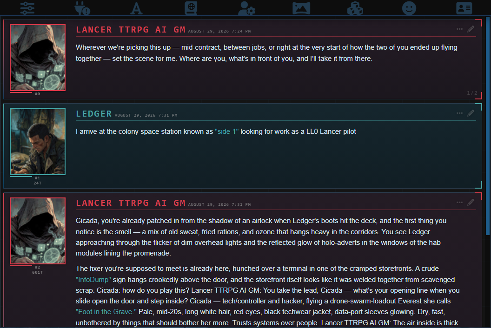
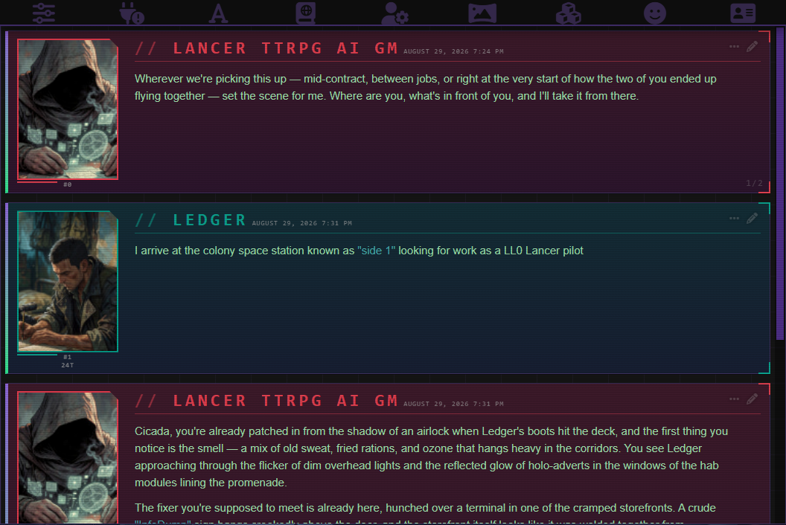
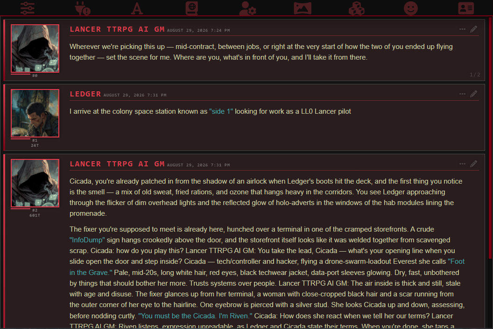
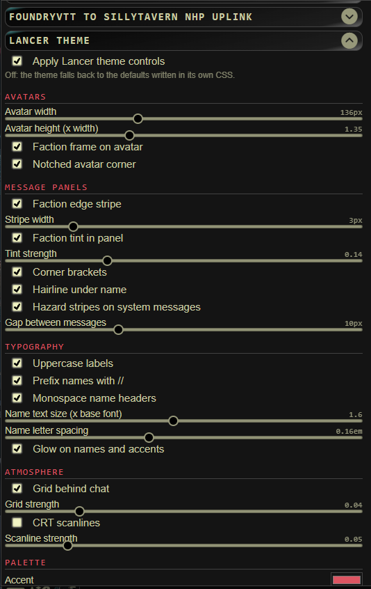
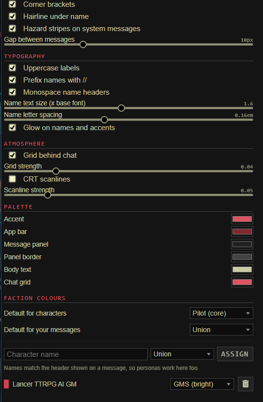

# Lancer // CompCon — SillyTavern theme

[](manifest.json)
[](https://github.com/masterevan27/sillytavern-lancer-ui-theme/actions/workflows/validate.yml)
[](https://github.com/SillyTavern/SillyTavern)
[](LICENSE)

A SillyTavern UI theme built on COMP/CON's actual palette, plus a small
extension that turns the theme's options into checkboxes and sliders.



Messages are colour-coded by Lancer manufacturer — assign a faction per
character, or let the two defaults handle it. Above is **IPS-N // Cold Deck**,
the preset a fresh install starts on; two others ship alongside it, and the
whole look is a dropdown away. See [Presets](#presets).

Built alongside
[**FoundryVTT → SillyTavern NHP Uplink**](https://github.com/masterevan27/foundryvtt-to-sillytavern-nhp-uplink),
which streams live LANCER combat out of Foundry VTT into SillyTavern so a card
can run as an AI GM. Neither needs the other — this is a plain SillyTavern theme
— but the faction colouring was tuned for that kind of table. See
[Companion project](#companion-project).

## What's here

| File | Purpose |
| --- | --- |
| `lancer-compcon.css` | The theme. Source of truth — edit this, not the JSON. |
| `Lancer CompCon.json` | Generated theme preset, imported through SillyTavern. |
| `build-theme.js` | Bakes the CSS into `Lancer CompCon.json`; `--install` copies both parts into SillyTavern. |
| `manifest.json`, `index.js`, `style.css`, `presets.js` | The "Lancer Theme Controls" UI extension. These sit at the repo root so SillyTavern's extension installer can clone this repo directly. |
| `presets/` | The bundled presets, as shareable files. Generated from `presets.js` - edit them there. |

## Install

Two halves: the **theme** (colours and layout) and the **extension** (the
checkboxes and sliders that drive it). The theme works on its own; the
extension does nothing without it.

### 1. Extension

In SillyTavern: **Extensions → Install extension**, and paste:

```
https://github.com/masterevan27/sillytavern-lancer-ui-theme
```

### 2. Theme

**User Settings → Themes → Import**, and pick `Lancer CompCon.json` from this
repo. Then select **Lancer CompCon** in the theme dropdown.

Reload the browser after both steps.

<details>
<summary><strong>Installing from a local clone (only if you are editing the CSS)</strong></summary>

If you are editing the CSS, `--install` copies both halves straight into
SillyTavern. Point it at your user-data directory — the folder containing
`themes/` and `extensions/`, usually `<SillyTavern>/data/default-user`:

```
node build-theme.js --install --st-root="D:/SillyTavern/data/default-user"
```

`ST_ROOT` works as an environment variable instead. Without `--install` the
script only regenerates `Lancer CompCon.json` next to itself.

</details>

## Presets

A preset is the whole look — every switch, slider and swatch — as one small
JSON file. Three ship with the extension and appear in the dropdown on a fresh
install:

| Preset | The look |
| --- | --- |
| **IPS-N // Cold Deck** | Cold blue, no glow, square avatars, faint grid. Reads as instrumentation. **The default** — a fresh install starts here. |
| **HORUS // Deep Signal** | Purple and terminal green, scanlines on, heavy gradient. The loudest of the three. |
| **GMS // Field Manual** | Austere: no glow, no grid, no gradient, flat red-on-black. Closest to print. |

They live in [`presets/`](presets) if you want to read one before importing it.

<details>
<summary><strong>The other two, in the same chat</strong></summary>

Same three messages as the shot at the top of this page, so the difference is
the preset and nothing else.

**HORUS // Deep Signal**



**GMS // Field Manual**



</details>

<details>
<summary><strong>Saving, sharing and importing</strong></summary>

Under **Extensions → Lancer Theme → Presets**:

- **Saved look** — pick one and it applies immediately.
- **Save** — stores the current settings under the name in the box. An
  existing name is overwritten, after a confirmation.
- **Export** / **Import** — a `.json` file, for sending someone the whole look.
- **Copy** / **Load** — the same preset as a base64 share code, for pasting
  into a Discord message.
- **Include the character list when saving** — off by default, so a shared
  preset carries the look and not your table's character names.

A fresh install starts on **IPS-N // Cold Deck**, and that happens exactly
once, on an install with nothing stored yet. An install that has been used
before keeps whatever it was last set to. **Reset to theme defaults** still
means the values `lancer-compcon.css` declares rather than that preset — pick
it from the dropdown to come back to it.

A preset does not carry the master switch, so importing one never silently
turns the extension on or off. Anything a preset leaves out falls back to the
theme default rather than to whatever the last preset set, so switching
between two presets never leaves a stray knob behind.

Old presets keep working: each one records the settings version it was written
against and is migrated forward on import, the same way stored settings are.

</details>

<details>
<summary><strong>Why imports are filtered</strong></summary>

These values are written into CSS custom properties on `<html>`, and the theme
feeds those to `background` and `clip-path` — so a preset that could carry its
own CSS could make your browser fetch a remote `url()`. Since presets are meant
to be traded between strangers, every imported value has to get past a check
before it is stored:

- keys must be options this build declares; anything else is dropped
- colours must match `#RRGGBB` — no other string is accepted
- sliders are coerced to numbers and clamped to their own min and max
- checkboxes become real booleans and only ever select between the option's
  own two CSS values, so a preset can never supply CSS of its own
- faction names must be keys the theme actually defines

A file that survives none of that is rejected outright rather than partly
applied. The presets bundled here go through the same gate as a downloaded one.

</details>

<details>
<summary><strong>Editing the bundled presets</strong></summary>

`presets/*.json` is **generated**. The source is `presets.js`, which is what
the extension itself loads — including `DEFAULT_PRESET_NAME`, the one line that
decides which built-in a fresh install adopts. Edit a preset there and rebuild:

```
node build-theme.js
```

CI regenerates and diffs both `presets/` and `Lancer CompCon.json`, so a preset
edited in only one of the two places fails the build.

</details>

## Companion project

<details>
<summary><strong>Turning a SillyTavern character card into an AI GM for a live LANCER game</strong></summary>

[**FoundryVTT → SillyTavern NHP Uplink**](https://github.com/masterevan27/foundryvtt-to-sillytavern-nhp-uplink)
turns a SillyTavern character card into an AI GM for a live LANCER game: a
Foundry module streams the real combat — attacks, damage, structure, statuses,
board state — into SillyTavern, the card narrates it, and its replies go back
into Foundry chat. Foundry stays the authority on mechanics; the model only
writes fiction.

Neither project requires the other. The uplink runs under any SillyTavern theme,
and this theme is just a theme without it. Together, the faction colours give you
the AI GM, your pilots and the hostiles distinguishable at a glance mid-fight —
which is what they were tuned for. Its README lists the theme as an optional
install step.

</details>

## Palette

Read verbatim off COMP/CON's `.v-theme--gms_dark` block — the app's default
dark GMS theme — not eyeballed. (Its other registered themes are `gms`,
`ipsn`, `ssc`, `ha`, `horus`, `msmc`, `galsim`, `horizon`, `hc_dark`,
`theme_lc_solarized`, plus plain `light` / `dark`.)

<details>
<summary><strong>The nine tokens, and the faction colours</strong></summary>

| Token | Hex | Use |
| --- | --- | --- |
| background | `#11151C` | app background |
| surface | `#161C27` | chat surface |
| panel | `#212D40` | message panel |
| panel-border | `#364156` | borders |
| text | `#C9CBA3` | khaki body text |
| primary | `#802932` | app bar red |
| accent | `#DD5562` | highlight red |
| secondary | `#48A6A7` | teal, used for quotes |
| core | `#D4E157` | core power yellow |

Faction colours for per-character message coding are the Lancer manufacturers:
GMS, IPS-Northstar, Smith-Shimano, Harrison Armory, HORUS, Union, NHP, plus
Hostile / Unaligned / Pilot slots.

</details>

## How the toggles work

<details>
<summary><strong>The settings panel, in full</strong></summary>

Everything the theme exposes, as it appears under **Extensions → Lancer
Theme** — avatars, message panels, typography and atmosphere up top, then the
palette swatches and faction assignments:

| | |
| --- | --- |
|  |  |

</details>

<details>
<summary><strong>Which CSS variables the extension writes</strong></summary>

The theme declares everything as CSS custom properties in its CONFIG block.
The extension writes those same variables as inline styles on `<html>`, which
override the theme's defaults. Nothing is hardcoded in the extension and
nothing is hardcoded in the CSS beyond a default value:

- numeric switches are `1` / `0` and get multiplied into a length or opacity
  (`--lcr-on-stripe`, `--lcr-on-brackets`, `--lcr-on-glow`, …)
- keyword switches swap a whole value (`--lcr-caps: uppercase | none`,
  `--lcr-name-prefix: "// " | ""`)
- sizes are plain lengths (`--lcr-avatar`, `--lcr-stripe-width`)

</details>

<details>
<summary><strong>The panel gradient, and the two control states</strong></summary>

**Message panels** take a colour wash: it starts at that message's own faction
tint and runs to a second colour at the far edge, so a panel reads as a
gradient rather than one flat block. Four knobs drive it, under **Message
panels** and **Palette**:

| Variable | Default | Use |
| --- | --- | --- |
| `--lcr-on-mes-gradient` | `1` | off returns the flat faction tint |
| `--lcr-mes-gradient-strength` | `0.33` | how much of the far colour lands at the far edge, 0 - 1 |
| `--lcr-mes-gradient-angle` | `180deg` | direction of the wash |
| `--lcr-mes-gradient-color` | `#000000` | the far end |

**The edge stripe** is a gradient too, painted as a background layer over a
transparent border (a border cannot hold one). `--lcr-on-stripe` and
`--lcr-stripe-width` still switch and size it:

| Variable | Default | Use |
| --- | --- | --- |
| `--lcr-on-stripe-faction` | `0` | `1`: start at the message's faction colour instead |
| `--lcr-stripe-from` | `#FF2E63` | top of the stripe, when the switch above is off |
| `--lcr-stripe-to` | `#7A3FBF` | bottom of the stripe |
| `--lcr-stripe-angle` | `180deg` | direction, top to bottom |

**Stripe starts at faction colour** is off by default: every stripe reads the
same, and faction coding lives on the name, brackets and avatar frame. Turn it
on and each stripe starts at its own faction colour and still runs into
`--lcr-stripe-to`.

**Controls** — buttons, top-bar drawer icons, character rows, the composer and
its send / options glyphs — sit red at rest and go purple when hovered or
selected:

| Variable | Default | Use |
| --- | --- | --- |
| `--lcr-ctl-idle` | `#DD5562` | border and glyph at rest |
| `--lcr-ctl-active` | `#7A3FBF` | fill when hovered or selected |
| `--lcr-ctl-active-edge` | `#B57BFF` | its border, text and glow |

The purples are not COMP/CON tokens — they are HORUS-adjacent. Point all three
at reds for the old single-hue chrome.

</details>

Turning the extension's master switch off removes every inline variable, so the
theme falls back to what's written in `lancer-compcon.css`. Switching to a
different SillyTavern theme drops the whole look regardless.

<details>
<summary><strong>Per-character colours, and how names are matched</strong></summary>

Per-character colours are emitted as a generated stylesheet:

```css
body #chat .mes[ch_name="Ledger"] { --lcr-mes-accent: var(--lcr-f-horus); }
```

Matching is on the name shown in the message header, so personas can be
assigned the same way characters are.

</details>

## License

Copyright (C) 2026 masterevan27.

GPL-3.0-or-later — see [LICENSE](LICENSE). This covers the theme and the
"Lancer Theme Controls" extension in this repository;
[the uplink](https://github.com/masterevan27/foundryvtt-to-sillytavern-nhp-uplink)
is a separate project in its own repository, under its own copy of the same
licence.

LANCER is a trademark of Massif Press. COMP/CON is their character builder; the
palette here was read off its GMS dark theme. This is an unofficial community
tool with no affiliation to Massif Press or the SillyTavern project.
